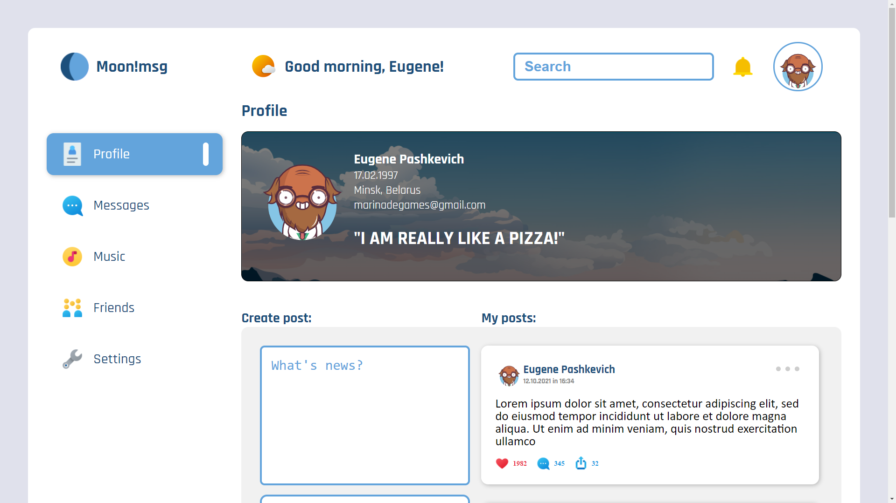

# 🌑 Social Network \ Moon!msg

## ♻️ RELOAD PROJECT | TypeScript | New name | New layout v3.0 ##

### ❓ What's this app? ###

This repository for my social network `Moon!msg`!

### Updates:

🔘 `v0.0.1` - RESTARTING the network to the `TypeScript` | New README file  
🟣 `v0.0.2` - FIRST layout | added `React-router` v.5.3.0 | fix package.json  
🟡 `v0.0.3` - `React-router-dom` v4.3.1 | Use `Router`  
🟠 `v0.0.4` - added `NavLink` | added other pages  
🟨 `v0.0.5` - added `Dialogs` | other fix  
🗺️ `v0.0.6` - added `.map`   
🚚  `v0.0.7` - Transfer Data to index.js  
☑️ `v0.0.8` - `LAYOUT` | added box "friends" in Nav | Transfer data to `store.tsx` | refactor code  
🌴    `v0.0.9` - added `ref` + `onclick` Post and Message  
🔧 `v0.1.0` - added typing to state file  
📝 `v0.1.1` - added the ability to make posts  
📨 `v0.1.1` - added `Store` and `Dispatch(action)`  
🎊 `v0.1.2` - added `action`  
🎞️ `v0.1.3` - added the ability to `send message` in dialog  
🚫 `v0.2.0` - `RELOAD PROJECT!!!` Delete all components and `new layout concept v2.0`  
🤯 `v0.2.1` - added new `header` | added `Big Heads`  
😶‍🌫️ `v0.2.2` - added `logotype site` | header completed!  
🧑‍🏫 `v0.2.3` - added `profile information`  
📓 `v0.2.4` - added `add note` card | added `max length` in textarea add note  
🌑 `v0.3.0` - RENAME PROJECT: `Moon!msg` 🌑 | Create `new layout concept v3.0` in Figma | Start create layout  
📙 `v0.3.1` - added layout `Profile` page    
🛠️ `v0.3.2` - fix layout `Profile` page  
🆔 `v0.3.3` - added `UUID`  
📝 `v0.3.4` - added `temp Store` | added `props` in Posts  
⌨️ `v0.3.5` - enter key => `add new post`    
🔗️ `v0.3.6` - added `react-router-dom` and changed pages | added 404 not found page    
🐈 `v0.3.7` - added page `404 not found` with cat 😁   
🐈 `v0.3.8` - added `GitPage` ===> <b>[GO TO MY GIT PAGE](https://marinadegames.github.io/moon-msg) </b>  
📩 `v0.3.9` - added `MessagesAPIContainer page` layout  
🛠️ `v0.4.0` - fixed menu  
🧈 `v0.4.1` - create `state`  
🔢 `v0.4.2` - fixed `state` and fixed `dialogs`  
😝 `v0.4.3` - send message | fix state and create store  
🎆 `v0.5.0` - added `redux`  
🦾 `v0.5.1` - added `react-redux` | refactor store | other fix | added map friends  
📩 `v0.5.2` - added `axios`  

➕ `v0.5.3`:
* added `follow\unfollow`
* `rebuilding` state users
* added `follow\unfollow button` (users page)
* fixed types
* added `tests` for reducers  

🛹 `v0.5.4`:
* avatar for `header`
* fixed `BigHead` file
* fixed `props`
* typing moved to `reducers`
* `removed` other comments
* delete old `store-file`  

📱 `v0.6.0` - `⚠️REBUILD PROJECT!⚠️`:  
* added `API`
* refactor `state`
* refactor `state types`
* added new `Action Creators` and `reducers`  

✨ `v0.6.1`:
* `float` left sidebar
* added `API-users` 
* added `class-component`
* added `new tests`
* `rebuild` state
* added `new cases` in reducer  

💡 `v0.6.2` - added container component `<FriendsContainer/>`  
📮 `v0.6.3` - added `preloader gif`. Refactor `connect`  
🔦 `v0.6.4` - added `pages profiles` for each profile  
🔵 `v0.6.5` - added `follow` \ `unfollow` users | API request  

🛠️ `v0.6.6`:  
* `follow\unfollow` buttons `disable` during loading
* added `pages profiles` for each profile
* `fixed` URL
* `fixed` NavLink
* added `home page`
* `home page` - it's start page  

##### ================================================ #####  

👁️ `v0.6.7` - added `login` | added `thunk` SetProfile | fixed any bugs | added types, fixed types  

### 🙃 Good luck for me!

## `🚀 vjuuuuuuhhhhhhhhh 🚀`    

